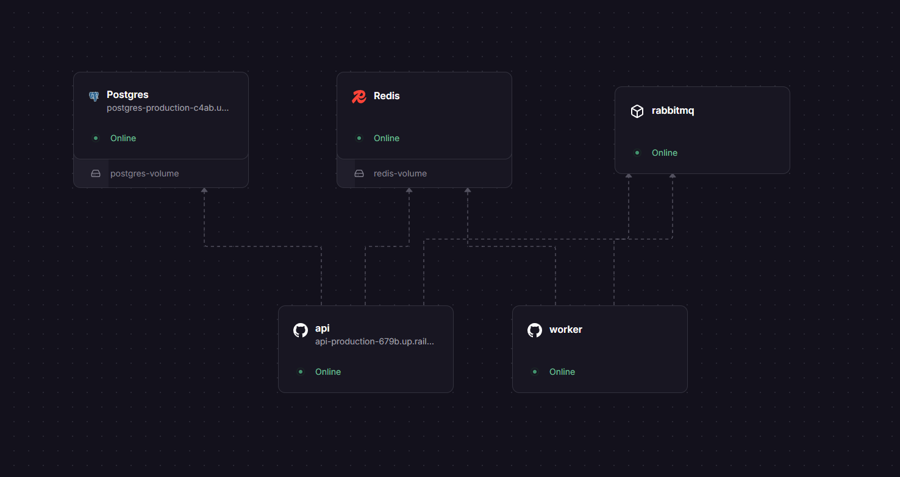

# 🔗 URL Shortener


A production-grade URL shortening service built with **Node.js**, **Express**, **PostgreSQL**, **Redis**, and **RabbitMQ** — deployed on Railway.

Click analytics are processed asynchronously via a dedicated RabbitMQ worker. Redirects are never slowed down by analytics writes. Redis is used in four distinct patterns: cache, atomic counter, sliding window rate limiter, and token store. Auth is a two-token JWT system with immediate revocation via a Redis blocklist.

> 🌐 **Live demo:** https://api-production-679b.up.railway.app/

---

## 🏗️ Architecture

```
POST /shorten  →  JWT verify  →  Postgres (store URL)

GET  /r/:code  →  Redis cache
                    ├── HIT:  instant redirect (no DB query)
                    └── MISS: Postgres → cache → redirect
                ↓
            RabbitMQ (fire & forget — redirect never waits)
                ↓
            Worker process (separate service)
                ↓
            Redis INCR (atomic click counter)

GET /analytics/:code  →  Postgres metadata + Redis click count
```

---

## 🚀 Deployment

Deployed on **Railway** with 5 services communicating over Railway's private network:

| Service | How |
|---|---|
| API server | Built from Dockerfile |
| Click worker | Same image, different start command |
| PostgreSQL | Railway plugin |
| Redis | Railway plugin |
| RabbitMQ | Railway Docker service (`rabbitmq:3-alpine`) |

Services connect via `*.railway.internal` hostnames — no public ports exposed for infra, no credentials in transit. The worker and API share the same Docker image but run independently; the worker can crash and restart without affecting redirects.



CI runs on every push via **GitHub Actions** — spins up all three infra services as containers, boots the API, and hits `/health` to verify all connections before marking the build green.

---

## 🖥️ UI

A minimal frontend served at `/` — login/register, shorten URLs, copy, delete, and inline click stats.

### Login / Register


### Regular user


### Admin user


> Admins see a **👑 User Management** panel with live ban/unban controls. Banning a user immediately invalidates their refresh token — they cannot obtain new access tokens.

---

## 🔑 Auth Design

Two-token system built around a key tradeoff: **JWTs are stateless and cannot be revoked**. Keeping them short-lived (15 min) limits damage if stolen. Refresh tokens live in Redis and are deleted instantly on logout or ban.

| Token | Lifespan | Storage | Purpose |
|---|---|---|---|
| Access token (JWT) | 15 min | Client only | `Authorization: Bearer` on every request |
| Refresh token (UUID) | 7 days | Redis | Silently renew access token |

**Immediate revocation** is handled two ways:
- `POST /auth/invalidate` — blocklists the token's `jti` in Redis with TTL = remaining lifetime. Auto-expires, no cleanup needed.
- `POST /auth/admin/ban/:userId` — sets `banned:{userId}` in Redis (no TTL) + deletes their refresh token. Every subsequent request is rejected at the middleware level.

---

## ⚡ Redis Patterns

Four distinct patterns — each solves a different problem:

| Key | Pattern | Why |
|---|---|---|
| `url:{code}` | Cache (TTL 1h) | Redirects skip Postgres on cache hit |
| `clicks:{code}` | Atomic INCR | Safe under concurrent writes — no race conditions |
| `rate:{ip}` | Sorted set sliding window | Accurate per-IP limiting across a rolling 60s window |
| `refresh:{userId}` | String (TTL 7d) | Revocable session — deleted on logout or ban |
| `blocklist:{jti}` | String (TTL = remaining lifetime) | Immediate token invalidation, auto-cleanup |
| `banned:{userId}` | String (no TTL) | Permanent user block until manually lifted |

---

## ⚙️ CI/CD

Every push to `main` (except docs/screenshots) triggers a GitHub Actions workflow:

1. Spins up Postgres, Redis, and RabbitMQ as service containers
2. Installs dependencies and initializes the database schema from `init.sql`
3. Boots the API server
4. Polls `/health` until ready, then asserts all three services return `"ok"`

Pushes that only change `.md` files or `screenshots/` skip CI entirely.

---

## 🏃 Running Locally

### Option 1 — Docker (recommended)

Requires [Docker Desktop](https://www.docker.com/products/docker-desktop). No other installs needed — Postgres, Redis, RabbitMQ, API, and worker all start together.

```bash
docker compose up --build
```

Tables are created automatically on first run. Open `http://localhost:3000`.

```bash
docker compose down      # stop, keep data
docker compose down -v   # stop, delete data
```

### Option 2 — Local

Requires PostgreSQL, Redis, and RabbitMQ running locally.

```bash
cp .env.example .env   # fill in your values
npm install

# Terminal 1
npm run dev

# Terminal 2
npm run worker
```

Create the schema:
```sql
CREATE DATABASE shortener;
\c shortener
-- then run the contents of init.sql
```

> **Windows / WSL Redis:** `wsl sudo service redis-server start`

---

## 📡 API Reference

### 🔐 Auth

| Method | Endpoint | Auth | Description |
|---|---|---|---|
| POST | `/auth/register` | — | Create account |
| POST | `/auth/login` | — | Returns `accessToken` + `refreshToken` |
| POST | `/auth/refresh` | — | Exchange refresh token for new access token |
| POST | `/auth/logout` | 🔒 | Deletes refresh token immediately |
| POST | `/auth/invalidate` | 🔒 | Blocklists current token by `jti` |
| POST | `/auth/admin/ban/:userId` | 🔒 👑 | Ban user + delete their refresh token |
| DELETE | `/auth/admin/ban/:userId` | 🔒 👑 | Lift ban |
| GET | `/auth/admin/users` | 🔒 👑 | List all users with ban status |

### ✂️ URLs

| Method | Endpoint | Auth | Description |
|---|---|---|---|
| POST | `/shorten` | 🔒 | Shorten a URL (optional `customCode`) |
| GET | `/urls/me` | 🔒 | List your active URLs |
| DELETE | `/urls/:shortCode` | 🔒 | Soft-delete (owner only, returns 404 either way) |
| GET | `/r/:shortCode` | — | Redirect (302, rate limited to 60 req/60s per IP) |
| GET | `/analytics/:shortCode` | — | Click stats |
| GET | `/health` | — | `{"postgres":"ok","redis":"ok","rabbitmq":"ok"}` |

> ⚠️ `totalClicks` only increments while the worker is running.

---

## 🧰 Tech Stack

| | |
|---|---|
| **Runtime** | Node.js v20 + Express v5 |
| **Database** | PostgreSQL — persistent storage, soft deletes, UUID PKs |
| **Cache / Store** | Redis — 4 patterns: cache, counter, rate limiter, token store |
| **Queue** | RabbitMQ — durable queue, dead-letter exchange, fire-and-forget publish |
| **Auth** | bcrypt (password hashing) · jsonwebtoken (JWT) |
| **Infra** | Docker Compose · Railway · GitHub Actions |

---

## 🐛 Common Errors

| Error | Fix |
|---|---|
| `ECONNREFUSED 5432` | PostgreSQL not running |
| `ECONNREFUSED 6379` | Redis not running — `wsl sudo service redis-server start` |
| `ECONNREFUSED 5672` | RabbitMQ not running |
| `401 Access token expired` | Call `POST /auth/refresh` |
| `403 Your account has been banned` | Contact admin |
| `totalClicks` always 0 | Worker not running — `npm run worker` |
| HTTP 429 | Rate limited — wait 60s |
| RabbitMQ UI not loading | `rabbitmq-plugins enable rabbitmq_management` |
